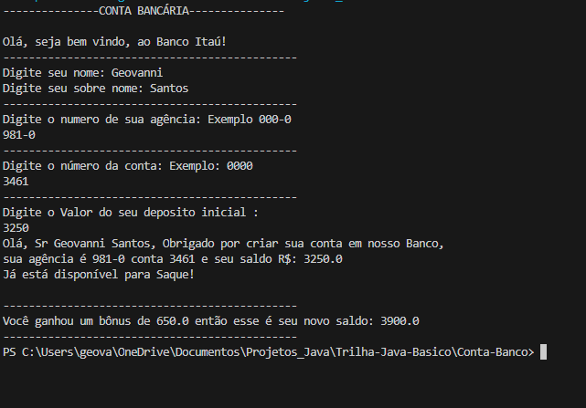

## Objetivo
Avaliar o engajamento do aluno quanto aos fundamentos da linguagem e noções de regras de estrutura de sintaxe.

## Pré-requisitos

- Diretório do projeto definido
- Integração com Github
- IDE configurada
- Noções de MS-DOS

## Dio - Trilha do Exécicio

- Link do desafio no github
- https://github.com/digitalinnovationone/trilha-java-basico-tree/main/desafios/sintaxe

# Conta Bancária Terminal

Simulando uma conta bancária através dop Terminal/Console

## Sintaxe - Desafio

Vamos exercitar todo o conteúdo apresentado no módulo de Sintaxe codificando o seguinte cenário.

1. Crie o projeto ´ContaBanco´ que receberá dados via terminal contendo as caracteristicas de conta em banco conforme atributos abaixo:
2. Dentro do projeto, crie a classe 'ContaTerminal.java' para realizar toda a codificação do nosso programa.

###### Revise sobre as regras de declaração de variáveis

| Atributo    | Tipo       | Exemplo
| --------    | ---------  | ---------
| Numero      | Inteiro    | 0000	
| Agencia     | Texto	   | 000-0
| Nome Cliente| Texto      | Texte
| Sobre Nome  | Texto      | Texte
| Saldo	      | Decimal    | 000-00	

##### Revise o terminal, main args e a classe Scanner

2. Permita que os dados sejam inseridos via terminal sendo que receberá a mensagem de qual informações  será solicitada, exemplo:

- Programa : "Por favor, digite o número da Agência !"
- Usuário : 1021 *(depois ENTER para o próximo campo)*

##### Revise sobre concatenação e classe String com método concat

3. Depois as informações terem sido inseridas, o sistema deverá exibir a seguinte mensagem:

*"Olá [Nome Cliente], Obrigado por criar uma conta em nosso banco, sua agência é [Agencia],conta [Numero] e seu saldo [Saldo] já está disponivel para saque".*

Os campos em [ ] devem ser alterados pelas informações que forem inseridas pelos usuários.
 

 ## Exemplo do console / terminal

 Exempo do console / terminal do código gerado para criação de conta!
 